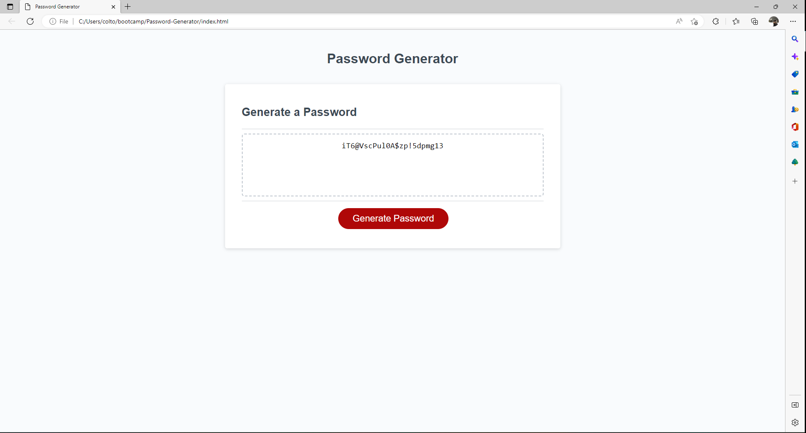

# Password-Generator
Generates a random password

When creating a password it can be difficult to create one that is strong enough to keep other people out. That is where a random password generator comes in and 
creates a password that as random characters and numbers at the length of theyre choosing.
I built this page to let the user generate a random password to use for security purposes.
This challange tought me a lot of how to write and call functions as well as use loops and arrays. It also tought me how to combine different arrays and ask the user questions.

